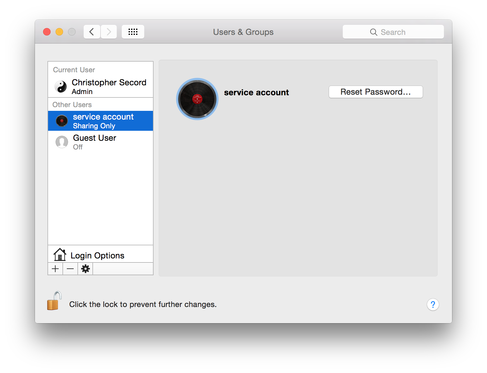
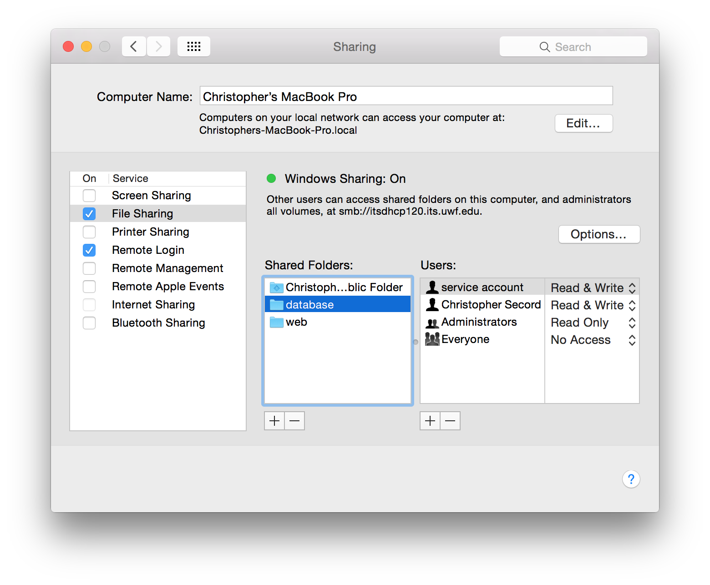

# create OSX user

# create share

# install mount.cifs

    apt-get install cifs-utils 

# edit fstab

    //192.168.56.1/database /mnt/database cifs user=serviceaccount,password=<password>,nounix,sec=ntlmssp,noperm,rw,noserverino 0 0